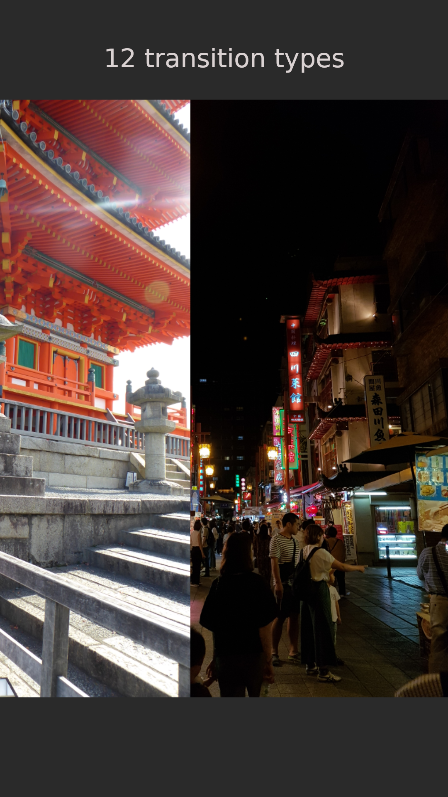
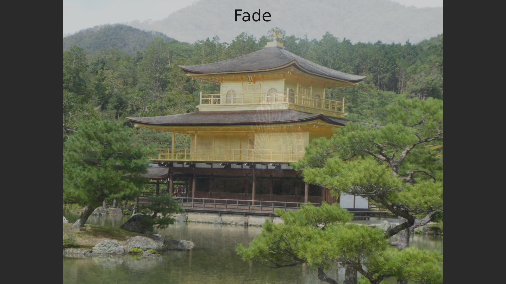
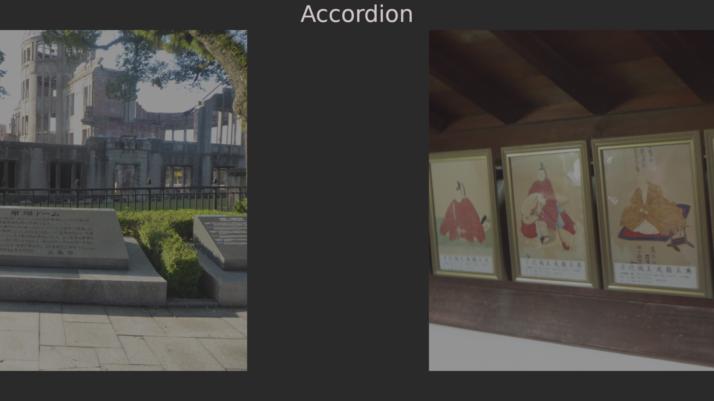
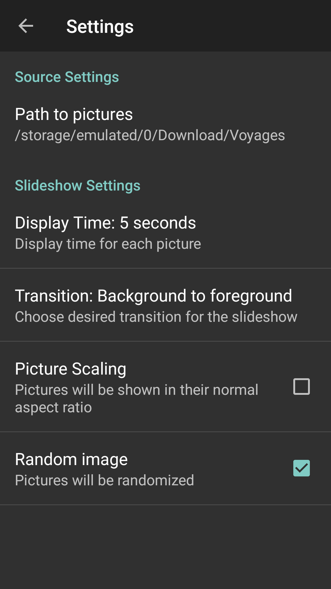

# SimpleFrame

Displays a slideshow of images to transform older devices into picture frames.

There are no networking features since old devices are inherently insecure. I recommend transfering the images using a USB connection.

## Screenshots

   

   

   

   

   

### License

Copyright (C) 2024 Louis-Simon Mc Nicoll.

SimpleFrame is free software: you can redistribute it and/or modify
it under the terms of the GNU General Public License as published by
the Free Software Foundation, either version 3 of the License, or
(at your option) any later version.

SimpleFrame is distributed in the hope that it will be useful,
but WITHOUT ANY WARRANTY; without even the implied warranty of
MERCHANTABILITY or FITNESS FOR A PARTICULAR PURPOSE.  See the
GNU General Public License for more details.

You should have received a copy of the GNU General Public License
along with SimpleFrame.  If not, see <http://www.gnu.org/licenses/>.

See also: [LICENSE](LICENSE)

#### Forked from PicFrame at https://github.com/PicFrame/picframe

##### Picframe license

Copyright (C) 2015 Martin Bayerl, Myra Fuchs, Clemens Hlawacek, Christoph Krasa, Linda Spindler, Ebenezer Bonney Ussher.

PicFrame is free software: you can redistribute it and/or modify
it under the terms of the GNU General Public License as published by
the Free Software Foundation, either version 3 of the License, or
(at your option) any later version.

PicFrame is distributed in the hope that it will be useful,
but WITHOUT ANY WARRANTY; without even the implied warranty of
MERCHANTABILITY or FITNESS FOR A PARTICULAR PURPOSE.  See the
GNU General Public License for more details.

You should have received a copy of the GNU General Public License
along with PicFrame.  If not, see <http://www.gnu.org/licenses/>.

See also: [LICENSE](LICENSE)
